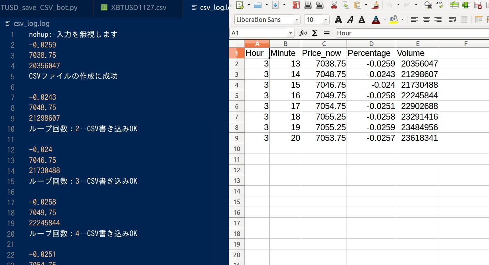

## How to Run

+ Oracle Cloud
+ Start New Instance
+ Connect SSH
+ set file
+ edit start hour and minute
+ check Python and pip
+ Run ( nohup python3 -u XBTUSD_save_CSV_bot.py > ./csv_log.log  2>&1 & )

## Stop nohup

+ ps ef
+ check PID No.
+ kill 〇〇 PID

> 記録した CSVファイル を取得する場合は、最初に フォーク して git clone すると扱いやすいと思います。
